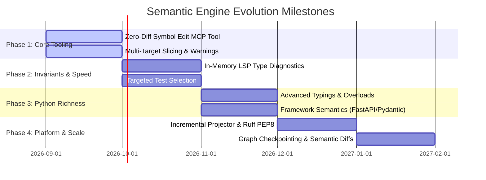

# CodeMesh: Architecture & Capabilities Roadmap

This document outlines the strategic roadmap for evolving **CodeMesh** into a comprehensive, production-grade semantic graph engine and runtime that optimizes how Large Language Models (LLMs) explore, reason about, modify, and generate Python software.

---

## 1. Vision & Core Philosophy

Current AI coding assistants interact with software through raw text files, line ranges, and regex search/replace patches. This model forces LLMs to waste valuable context window tokens on irrelevant boilerplate, suffer from fragile patch application failures, hallucinate missing contracts, and undergo slow, multi-turn feedback loops.

CodeMesh replaces this text-based paradigm with a **canonical, file-independent Semantic Graph** that provides:
1. **Surgical Context**: LLMs ingest only the target implementation body and the exact `.pyi` contract closure of direct dependencies.
2. **Zero-Diff Mutations**: Code edits occur at the logical symbol level (`edit_symbol(csi, body)`), eliminating line-number and whitespace failures.
3. **Instant Guardrails**: Invariants, type checks, and blast-radius analyses run in-memory before changes touch physical disk or CI.
4. **Clean Materialization**: Physical files, import headers, and package layouts are deterministically synthesized from graph edges.

```
┌─────────────────────────────────────────────────────────────────────────────────┐
│                              CODEMESH CAPABILITY ROADMAP                        │
├──────────────────────┬──────────────────────┬───────────────────────────────────┤
│ PILLAR 1: CONTEXT &  │ PILLAR 2: MUTATION & │ PILLAR 3: INVARIANTS &            │
│           NAVIGATION │           TOOLING    │           VERIFICATION            │
│ • Exact Closures     │ • Zero-Diff Edits    │ • In-Memory LSP Type Diagnostics  │
│ • Size Warnings      │ • Atomic Refactors   │ • Impacted Test Selection         │
│ • Multi-CSI Slices   │ • Architecture Studio│ • Contract Compatibility Checks   │
│ • Graph Discovery    │                      │                                   │
├──────────────────────┼──────────────────────┼───────────────────────────────────┤
│ PILLAR 4: PYTHON-    │ PILLAR 5: PROJECTION │ PILLAR 6: STATE, CHECKPOINTS      │
│           NATIVE     │           & QUALITY  │           & COLLABORATION         │
│ • Pydantic & FastAPI │ • Auto-Import Engine │ • Semantic Graph Diffs            │
│ • Async & Lifecycles │ • Ruff/Black PEP 8   │ • Checkpoints & Undo/Redo         │
│ • Advanced Generics  │ • Package Generator  │ • Multi-Agent Graph Partitioning  │
└──────────────────────┴──────────────────────┴───────────────────────────────────┘
```

---

## 2. Detailed Roadmap Pillars

---

### Pillar 1: AI Context Optimization & Semantic Navigation (Input Layer)
*Optimizing token efficiency, attention focus, and architectural discovery for LLMs.*

#### Key Capabilities & APIs
1. **Exact Contract Closure Slicing & Oversize Warning Telemetry**:
   * `ContextSlicer.build_slice(target_csi, warn_threshold_tokens=4000)`
   * Computes the complete, high-fidelity contract closure of direct dependencies (and optional callers) without omitting any critical signatures. Emits a non-destructive warning or telemetry event if the resulting closure exceeds a configured context threshold, rather than aggressively dropping required contracts.
2. **Multi-Symbol Task Slicing**:
   * `ContextSlicer.build_multi_target_slice(csis=[csi_service, csi_repo])`
   * Generates a unified prompt stub containing full implementation bodies for multiple related targets alongside their shared interface boundaries.
3. **Semantic Graph Query & Discovery API**:
   * `SemanticGraph.find_implementations(protocol_csi: CanonicalSymbolId) -> Set[CanonicalSymbolId]`
   * `SemanticGraph.find_callers_of_type(type_ref: str) -> Set[CanonicalSymbolId]`
   * `SemanticGraph.find_by_effect(purity: PurityType) -> Set[CanonicalSymbolId]` (e.g., locate all functions performing shared-state mutations or disk I/O).
4. **Side-Effect & Architectural Annotation**:
   * Automatically annotates prompt stubs with verified execution models (e.g., `# [ASYNC_EVENT_LOOP | MUTATES_SHARED]`).

#### Risks & Architectural Considerations
* **Graph Traversal Cycles**: Circular dependencies in Python packages can cause infinite loops or duplicate edges during closure computation if not guarded by visited-set tracking.
* **Large Interface Closures**: A symbol interacting with a sprawling monolith class could pull in large contract signatures; threshold warnings alert the agent to high complexity without introducing signature-truncation bugs.

---

### Pillar 2: High-Leverage LLM Tooling & Mutation APIs (Action Layer)
*Empowering agents with atomic, symbol-level manipulation tools that eliminate physical file diffs.*

#### Key Capabilities & APIs
1. **Zero-Diff Symbol Modification Tool (MCP / Agent API)**:
   * `MutationEngine.edit_symbol(csi: str, new_body: str) -> MutationResult`
   * Replaces function or method bodies directly by CSI. Zero line numbers, zero diff hunks, and zero regex patching required from the LLM.
2. **Atomic Semantic Refactorings**:
   * `MutationEngine.rename_symbol(csi: str, new_name: str)`: Renames a symbol and automatically updates all references, calls, type annotations, and docstrings across the semantic graph.
   * `MutationEngine.move_symbol(csi: str, new_namespace: str)`: Relocates a symbol to a new package or module; all import declarations across the repository are automatically reconciled on next projection.
3. **Top-Down Architectural Scaffolding**:
   * `MutationEngine.scaffold_contracts(namespace: str, contracts: List[SymbolContract])`
   * Allows the agent to design and validate interfaces, classes, and function contracts before generating any implementation bodies.
4. **Symbol Extraction & Inlining**:
   * `MutationEngine.extract_function(parent_csi: str, new_func_name: str, body: str)`

#### Risks & Architectural Considerations
* **AST Indentation & Normalization**: Method bodies generated by LLMs may have inconsistent indentation or lack enclosing class headers; the engine must parse and re-indent incoming bodies cleanly.
* **Intra-Symbol Closures & Decorators**: Replacing a function body that references outer lexical scope or closure variables requires validating local vs. foreign variable bindings.
* **Orphaned Docstrings & Comments**: Modifying implementations without structured metadata may accidentally strip inline comments or architectural documentation unless explicitly modeled in the AST.

---

### Pillar 3: Fast Invariant & Verification Engines (Guardrail Layer)
*Real-time semantic feedback that catches bugs, type errors, and breaking changes before disk I/O.*

#### Key Capabilities & APIs
1. **In-Memory Live LSP Diagnostics**:
   * `MutationEngine.verify_in_memory(graph, mutation) -> List[Diagnostic]`
   * Pipes the proposed symbol replacement into the LSP server's in-memory document state (`textDocument/didChange`) to retrieve instant Pyright type errors without writing to disk.
2. **Selective Test Targeting**:
   * `SemanticGraph.get_impacted_tests(csi: CanonicalSymbolId) -> List[CanonicalSymbolId]`
   * Traces outgoing `VERIFIES` and incoming `CALLS` edges to identify the exact subset of unit tests that must run, avoiding expensive full-suite executions.
3. **Contract Compatibility Engine**:
   * Detects breaking signature mutations (e.g., adding required parameters without defaults, narrowing return types, or altering exception specs) and provides actionable repair hints in the agent error response.

#### Risks & Architectural Considerations
* **LSP State Desynchronization**: Sending synthetic in-memory buffers to Pyright without syncing dependent files can lead to false-positive diagnostics ("ghost errors").
* **Static Test-Mapping Incompleteness**: Dynamic test runners (e.g. `pytest.mark.parametrize` or integration tests hitting HTTP endpoints) may not be statically linked via LSP references, requiring hybrid runtime test tracing.
* **Verification Latency Budget**: If type-checking and invariant validation take more than 200–500ms per edit, agent iteration velocity will degrade.

---

### Pillar 4: Python-Native Semantic Richness (Language Specialization)
*Deep modeling of Pythonic patterns, frameworks, and metaprogramming constructs.*

#### Key Capabilities & APIs
1. **Framework & Decorator Semantics**:
   * Explicit modeling of FastAPI/Flask routes (`@app.get("/items")`), Pydantic models & validators (`@field_validator`), and SQLAlchemy ORM models (`relationship(...)`).
2. **Advanced Typing & Generics**:
   * Full support for `TypeVar`, `Generic[T]`, `ParamSpec`, `Concatenate`, `Union`/`Optional`, structural `Protocol` checking, and multi-signature `@overload` stubs.
3. **Lifecycle & Execution Archetypes**:
   * Explicit tracking of context managers (`__enter__`/`__exit__`, `@asynccontextmanager`), generator pipelines (`yield`), and resource lifecycles.

#### Risks & Architectural Considerations
* **Dynamic Metaprogramming Limitations**: Python allows runtime monkey-patching and dynamic `setattr()` calls that cannot be statically resolved by LSP or AST analysis.
* **Ontology Complexity Overload**: Attempting to model every third-party framework's DSL could bloat `SymbolContract`. The core ontology must remain clean and generic, using metadata extensibility for frameworks.

---

### Pillar 5: Deterministic Materialization & Code Quality (Output Layer)
*Compiling pure semantic graphs into production-grade, beautifully formatted source trees.*

#### Key Capabilities & APIs
1. **Intelligent Import Synthesizer**:
   * Automatically resolves standard library vs third-party vs internal package imports, deduplicates module aliases, and resolves name collisions (`from typing import Sequence as Seq`).
2. **Integrated PEP 8 Formatting**:
   * Native integration with Ruff or Black during `FileSystemProjector.project_to_disk` to guarantee syntactically perfect, formatted Python code.
3. **Package Manifest Synthesis**:
   * Automatically generates `__init__.py` with explicit `__all__` exports and updates `pyproject.toml` dependencies based on foreign symbol references in the graph.

#### Risks & Architectural Considerations
* **Circular Import Generation**: Materializing interconnected symbols into separate physical modules can create runtime circular import errors (`ImportError: cannot import name X`) unless import topology is carefully ordered.
* **Top-Level Executable Code Loss**: Scripts containing raw module-level statements (outside classes/functions) must be preserved in special module-level node representations without being dropped during projection.
* **Disk I/O Scaling**: Projecting large repositories (thousands of files) must be incremental, writing only files whose symbols or imports were mutated.

---
 
 ### Pillar 6: Graph State, Checkpointing & Collaboration (Platform Layer)
 *Multi-step agent history, rollbacks, and multi-agent coordination.*

#### Key Capabilities & APIs
1. **Semantic Graph Checkpointing & Rollback**:
   * `SemanticGraph.create_checkpoint(label: str) -> CheckpointId`
   * `SemanticGraph.rollback(checkpoint_id: CheckpointId)`
   * Enables agents to explore speculative refactorings and revert cleanly if invariant checks or tests fail.
2. **Semantic Graph Diffs**:
   * `SemanticGraph.diff(other_graph: SemanticGraph) -> SemanticDiffReport`
   * Produces high-level contract diffs ("Added parameter `timeout` to `OrderService.charge`") rather than raw text line diffs.
3. **Multi-Agent Partitioning**:
   * Allows multiple autonomous subagents to work concurrently on isolated subgraphs of the architecture, merging changes through contract validation.

#### Risks & Architectural Considerations
* **Memory Overhead of Snapshots**: Storing full deep copies of large graphs on every checkpoint can cause high memory usage; requires copy-on-write or structural sharing data structures.
* **Concurrent Merge Conflicts**: Merging simultaneous graph mutations from multiple agents requires semantic resolution strategies (e.g. CRDT-like graph operations) when two agents modify the same contract.

---

### Pillar 7: Deferred & Contingent Features (Maybe / Re-evaluate Later)
*Features held in reserve until empirical agent usage demonstrates a clear necessity.*

1. **Token-Budgeted / Lossy Closure Slicing**:
   * *Concept*: Forcibly trimming or summarily truncating dependency contracts to fit an artificial hard token limit (e.g., `< 2048` tokens).
   * *Why Deferred*: Since the semantic engine already strips all foreign implementation bodies and only transmits lightweight `.pyi` signature contracts, typical closures naturally consume very few tokens. Forcibly dropping contracts risks inducing LLM hallucinations for missing types. We prefer **threshold warnings** over lossy pruning unless empirical benchmarking on massive legacy monoliths proves token overflow is a frequent problem.
2. **Vector RAG Hybrid Search on Semantic Nodes**:
   * *Concept*: Embedding vector representations of docstrings to allow natural-language similarity search across symbols.
   * *Why Deferred*: Pure relational graph traversal (`find_callers`, `find_implementations`, `find_by_type`) provides deterministic, exact results without embedding drift or vector index synchronization overhead.

---

## 3. Phased Implementation Milestones



---

## 4. Immediate Next Steps

1. **Implement `edit_symbol` MCP Tool**: Expose a zero-diff mutation tool to allow agents to edit code without file offsets.
2. **Add Context Size Warning Telemetry to `ContextSlicer`**: Emit non-blocking advisory warnings when a slice exceeds high-watermark token thresholds.
3. **Connect In-Memory LSP `didChange` Diagnostics**: Integrate real-time type error feedback directly into the mutation pipeline.

